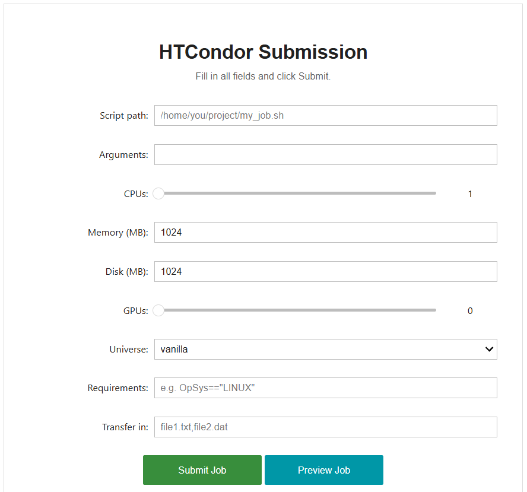

# HTCondor Job Submission Interface

This project is an easy to use Voila interface, allowing users to submit their deep learning jobs and other projects onto a HTCondor computing cluster, without needing to run anything from the command line. This simplifies the process of running variations of jobs and different projects, allowing more time to be spent experimenting and doing the important work, along with opening up the possibility for non-computing experts and researchers to use HTCondor.

---

## Features

Users are presented with a Job submission form, allowing them to customise the following values by filling in fields:

- <u> Customisable Fields </u>
    - Job Script Selection
    - Argument configuration
    - Resource Requests (CPUs, Memory, Disk, GPUs)
    - Environment Selection
    - Custom Requirements

This form mirrors what the user would create in a .sub (submit) file, allowing them to simply fill in the desired fields. Any non-required fields
can be left blank.

A preview button is also available so that users with more HTCondor experience can see what the submit file would look like, and make sure it's all correct before submitting.

An output box is displayed under the submit/preview buttons, providing users with valuable information about errors, successful submissions and missing values.

Finally, the current job queue on the HTCondor cluster can be viewed from the manage jobs tab.

